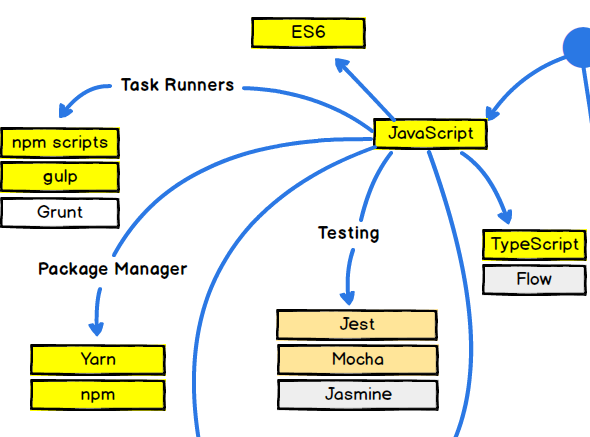

# JavaScript что дальше?
В первых двух частях вы прошли фундаментальные основы JavaScript, которые являются стабильными и проверенными годами практического применения.

Тем не менее специализация Фронтенд разработки является наиболее динамичной отраслью в мире web технологий, и с каждым годом скорость этих изменений только возрастает. 

В этой ситуации для того, чтобы стать специалистом Фронтенд - Вам необходимо засучить рукава и начать движение в сторону дальшейшего развития своих компетенций.

Давайте более детально пройдемся по тому, что Вам недо изучить.


# Дорожная карта 2017


- Посмотрите на карту, как можно наблюдать Вы находитесь в самом начале пути.

## Шаг первый - "Двигаемся глубже"

- На этом этапе Вы, как будующий фронтенд программист должны расширить свои знания в следующих технологиях:
    - JavaScript
    - CSS
## JavaScript


1) **ES6** - Современная нотатация стандарта EcmaScript (*)
   - новые обьявление переменных - `let` и `const`
   - деструктуризация массивов и объектов
   - стрелочные функции
   - итераторы
   - генераторы
   - классы
   - модули
   - асинхронные функции
   - коллекции
   - и.т.д
1) **Package Managers** - служат для развертывание приложений и загрузки библиотек из сетевого хранилища.
    - **Пример**: Выполним в консоли следующую последовательность действий:
    ```bash
    npm init   
    ```
    - проследуем диалогам
    ```bash
      name: (npminit) test
      version: (1.0.0) 1.0.3
      description: myFirstTestApp
      entry point: (index.js) index.html
      test command: test.app
      git repository: git://gitlab/thisroot/test.git
      keywords: [myapp, myfirst]
      author: Egor Mikheev
      license: (ISC)
      
      Is this ok? (yes)
    ```
    - Теперь мы создали свое первое `node.js` приложение.
    - Установим web сервер
    ```bash
      npm install -S express
    ```
    - Добавим в `app.js` следующее содержимое
    ```js
      //подключили библиотеки
      var express = require('node_modules/express');
      var app = express();

      //установили настройкци
      app.set('port', (process.env.PORT || 3000));
      //подключили middleware
      app.use('/', express.static(__dirname));
      
      //запустили сервер на порту
      app.listen(app.get('port'), function() {
        console.log('Server started: http://localhost:' + app.get('port') + '/');
      });
    ```
1) **Task Runners** - менеджеры задач служат цели автоматизации выполнения различных служебных операций над вашим проектом (запуск режима приложения, проведение тестов, загрузка в репозиторий и др.)
    - Установим библиотеку
    - `npm install -S loadtest`
    - Создадим каталог `tests` и в нем файл `stress-tests.js`
    ```js
    var loadtest = require('loadtest');
    var options = {
        url: 'http://localhost:8000',
        maxRequests: 1000,
    };

    loadtest.loadTest(options, function(error, result)
    {
        if (error)
        {
            return console.error('Got an error: %s', error);
        }
        console.log('Tests run successfully');
        console.log(result);
    });
    ``` 

1) **Testing** - библиотеки предназначенные для тестирования приложения.
    - Тестирования логики различных компонентов приложения
    - Нагрузочного тестирования
    - Тестирования "битых ссылок"
    - и.т.д
